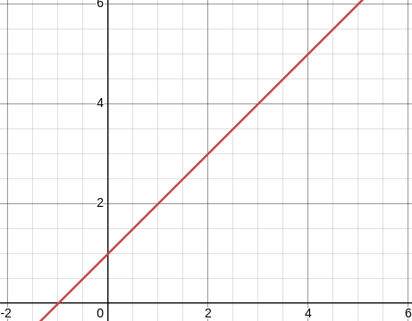

# Secret Sharing
This repository fully recreates the logic and math behind Shamir's Secret Sharing algorithm. 
 
I attempted to do this as much as possible by hand instead of relying on pre-built solutions 
in Python packages authored by others, relying only on a few key built-in packages that come 
with Python 3 for unique functionalities which are hard to build myself (e.g. <code>random</code>).

### 1. The idea
The algorithm allows a secret ($S$) (e.g. a passphrase, a number) to be split into any number ($n$)  
of components ($S_i$), where when a threshold number of shares ($t$) are brought together the secret  
is revealed. 
 
It does not matter which shares are brought together to reach the threshold amount if $t < n$, and  
furthermore, no more information can be gained about the secret as the number of shares brought  
together approaches $t$ (a characteristic called *perfect secrecry*).

### 2. Mathematical principles
The algorithm exploits the fact that the equation for a polynomial of degree $k$ can be determined  
with $k+1$ coordinates. For example, a first degree or linear polynomial can be  
uniquely defined by two coordinates on the Cartesian plane. For example, the polynomial below passes through  
$(1,2)$ and $(2,3)$, from which we can deduce that the polynomial pictured is defined by $y = x+1$. Similarly,  
a parabola's equation can be identified if we know three points on the parabola, and so on. 
 
 

 
 
The basic idea is that the secret, when encoded as a number, is the y-intercept of your polynomial. 
The degree of the polynomial is your threshold $t-1$. So if $S = 5$ and $t = 3$, we create a polynomial 
$y = a_1x^2 + a_2x + 5$ - a quadratic polynomial that requires three points to uniquely define. 
The coefficients $a_1$ and $a_2$ are randomly chosen and determine the sign and magnitude or the parabola 
and the horizontal shift, respectively.

### 3. Security

### 4. Limitations

polynomials

### Disclaimer

This algorithm should not be used for real-world security purposes.
Because

### Sources and further reading
https://en.wikipedia.org/wiki/Shamir's_secret_sharing

